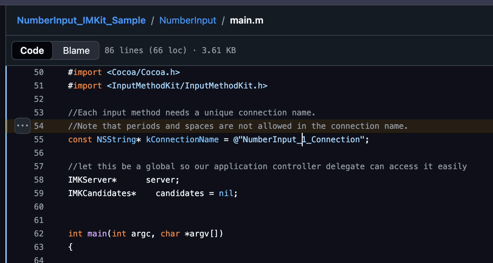
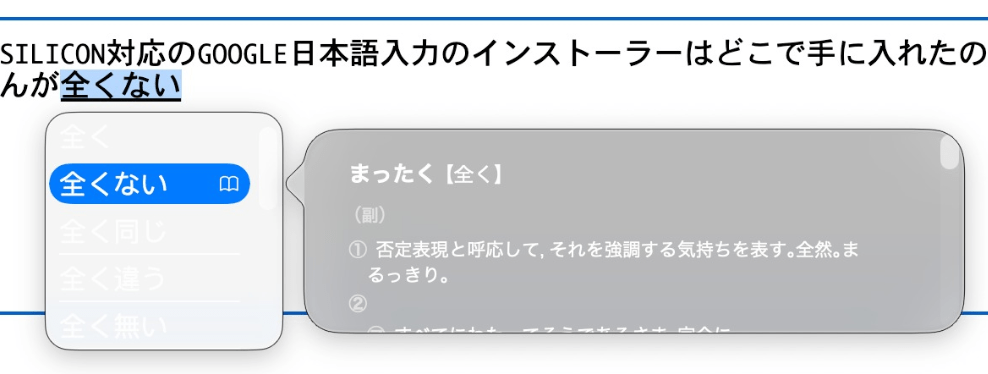
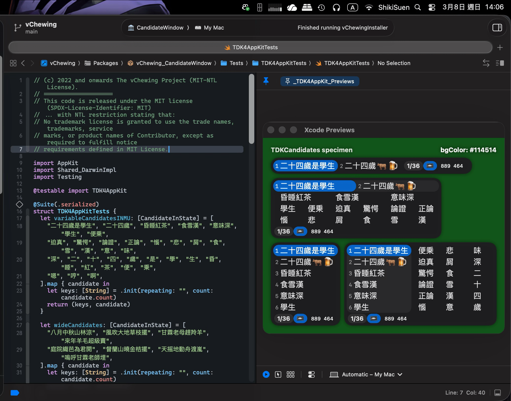

# 写在2026年的macOS输入法开发规范

InputMethodKit 自 macOS 10.5 Leopard 时代问世，早于 Objective-C ARC 技术、XPC 通讯技术、Sandbox 技术问世（均为 macOS 10.7）之前。自然，这也是早于 Swift 5 与 SwiftUI 流行之前。也就是说，InputMethodKit 是横跨了两代技术大变革的祖产级 OS Framework。当年 Apple 写给 macOS 10.5 Leopard 的 IMK 参考手册《[Input Method Kit Framework Reference](https://leopard-adc.pepas.com/documentation/Cocoa/Reference/InputMethodKitFrameworkRef/InputMethodKitFrameworkRef.pdf)》（下文简称《IMKFR》）早已不符合这些变革所带来的新要求（特别是 Swift 6 Concurrency）。笔者根据自己开发[《唯音输入法》(for macOS 10.09 Mavericks ~ macOS 26)](https://vchewing.github.io/)的经验，将一些注意事项整理在此，留给其他想给 macOS 开发输入法的工程师们参考。

> 笔者另外制作了 [IMKSwift](https://github.com/vChewing/IMKSwift) 套件，允许 Swift 工程师们在写 IMK 输入法时更顺利：IMKSwift 提供了 IMKInputSessionController 基础型别、是在 IMKInputController 的基础上整体换用了对 Modern Swift Concurrency 更友好的 ObjC Header 表达。使用这个套件的话，下文某些繁文缛节或可不必严苛遵守。

## 1. NSConnection 名称

《IMKFR》没提及，但正确答案只有一个：输入法的 `Info.plist` 的 `InputMethodConnectionName` 栏位只能填写 `$(PRODUCT_BUNDLE_IDENTIFIER)_Connection`。

> ⚠️ **这是 macOS 10.7 Lion 开始对 NSConnection 的命名规范**。
>
> 不按照这个规范命名的话，你的输入法在开启 Sandbox 之后，可能就会在用户尝试切换到该输入法的时候无法正常载入。此时可以在 `Console.app` 内观测到与 NSConnection 有关的失败讯息。

当年由 Apple 同步提供的「NumberInput」这个范例专案就给了[错误示范](https://github.com/pkamb/NumberInput_IMKit_Sample/blob/6c37ea05d85d0b7b5af9378a0ce88e191ca07241/NumberInput/main.m#L53-L55)，误导了全球的 macOS 输入法开发者们。官方误导，最为致命。



Apple 甚至都不得不给那些没开 Sandbox 的输入法们开小灶、允许它们在使用非正规命名的 NSConnection 名称的前提下继续正常工作。但这被某些输入法开发者们错误地视为「Sandbox 开了反而会坏事」。

## 2. Sandbox Entitlements

一定要开 Sandbox。macOS 输入法只要开了 Sandbox，就在**原理上**绝对无法拿到系统全局键盘权限了。**你的输入法因为系统框架限制的原因，不得不用 NSConnection 这么脆弱的东西，再不开 Sandbox 的话，就等于北港香炉人人插**。

「Sandbox 支援」对一款 macOS 输入法而言，堪称对用户的最佳的资安投名状。

> 于是剩下的几乎都是不敢开 Sandbox 的输入法了：或有技术难题，或支支吾吾。

Sandbox 权能档案的定义如下：

```xml
<?xml version="1.0" encoding="UTF-8"?>
<!DOCTYPE plist PUBLIC "-//Apple//DTD PLIST 1.0//EN" "http://www.apple.com/DTDs/PropertyList-1.0.dtd">
<plist version="1.0">
<dict>
  <key>com.apple.security.app-sandbox</key>
  <true/>
  <key>com.apple.security.files.bookmarks.app-scope</key>
  <true/>
  <key>com.apple.security.files.user-selected.read-write</key>
  <true/>
  <key>com.apple.security.network.client</key>
  <true/>
  <key>com.apple.security.temporary-exception.files.home-relative-path.read-write</key>
  <array>
    <string>/Library/Preferences/$(PRODUCT_BUNDLE_IDENTIFIER).plist</string>
  </array>
  <key>com.apple.security.temporary-exception.mach-register.global-name</key>
  <string>$(PRODUCT_BUNDLE_IDENTIFIER)_Connection</string>
  <key>com.apple.security.temporary-exception.shared-preference.read-only</key>
  <string>$(PRODUCT_BUNDLE_IDENTIFIER)</string>
</dict>
</plist>
```

可以看到这里将输入法自身的 UserDefaults 拉入白名单了。这是必需的，因为 macOS 的输入法做了 Sandbox 处理之后确实会丧失对自身 UserDefaults 的存取能力。

## 3. MainActor 约束与 Swift 6.2+

整个 IMKInputController 所有 API 交互都是走 MainActor 的。但是，InputMethodKit 曝露出来的 Header 与 Swift Concurrency 不相容，导致你在使用时反而无法将 IMKInputController 钉死在 MainActor 上。

让 InputMethodKit 与 Swift 6 Concurrency 相容性最佳的处理方法就是将整个 target 的 default isolation 设为 MainActor。这样虽然也难免需要对 IMKInputController 的 API 呼叫处理过程实施一些硬 Hack，但这算是相对而言工作量最小的。

你先引入这两个 extension API：

```swift
extension IMKInputController {
  nonisolated fileprivate func wrap(_ object: Any?) -> UInt? {
    guard let object = object as? AnyObject else { return nil }
    return UInt(bitPattern: Unmanaged.passUnretained(object).toOpaque())
  }

  nonisolated fileprivate func unwrap(_ addr: UInt?) -> Any? {
    guard let addr = addr, let ptr = UnsafeMutableRawPointer(bitPattern: addr) else { return nil }
    return Unmanaged<AnyObject>.fromOpaque(ptr).takeUnretainedValue()
  }
}
```

再使用这个 MainSync API（有经过处理，防止俄罗斯套娃 DeadLock）：
```swift
@discardableResult
public func mainSync<T>(execute work: @MainActor () throws -> T) rethrows -> T {
  if Thread.isMainThread {
    return try work()
  }
  return try DispatchQueue.main.sync(execute: work)
}
```

然后，这是范本，专门示范怎样将 API 的参数翻译到 MainActor 上：
```swift
/// nonisolated 是 IMKStateSetting & IMKMouseHandling 协定要求的。
/// 或者说，官方没要求，但是是 Swift 相容性没做好导致的现状。
@objc(MyIMKInputController) // 必须加上 ObjC，因为 IMK 是用 ObjC 写的。
nonisolated public final class MyIMKInputController: IMKInputController, @unchecked Sendable {

  @objc(handleEvent:client:)
  nonisolated override public func handle(
    _ event: NSEvent?,
    client sender: Any?
  )
    -> Bool {
    let eventRef = wrap(event)
    let senderRef = wrap(sender)
    return mainSync {
      let clientOnMain = unwrap(senderRef)
      let eventOnMain = unwrap(eventRef)
      // 此处存放业务逻辑。
    }
  }
}
```

可能有人注意到笔者将 `MyIMKInputController` 定义为 Sendable 了。不然 mainSync 无效。

## 4. IMKInputController 该脱手的任务一定要脱手

有些输入法难免会在 activateServer 阶段引入与 client() 有关的交互，但这个开销可能在所难免，因为你可能必须得对 client 使用 `client.overrideKeyboard()` 套用指定的 Ukelele 布局。再加上 client() 身为 IMKTextInput Client 没有真正意义上的 Async API，输入法开发者只能假设所有这类 Client 的这些操作都是 MainActor 阻塞操作，然后干瞪眼。

于是乎，除了 `client()?.setMarkedText` 与 `client()?.insertText` 以外，其余的 client methods 应该是都可以在 MainActor 上面 Async 脱手操作的。只要你严格按照前文所述将 IMKInputController 所有 API 交互都钉死在 MainActor 上，你就不用担心脱手操作所带来的乱序的问题。

> 注意：`client()?` 是 MainActor 限定物件。你脱手可以，但脱手操作的 Lambda Expression 在呼叫 client() 方法时必须在 MainActor 上。

## 5. IMKInputController 不要持有任何物件

这一点非常有必要。这里先给出一个（笔者此前在其他场合提到过的）应用场景：

> macOS 10.12 的这个 CpLk 切换功能的本质不是中英文打字模式切换，而是输入法切换。macOS 哪怕英文打字也是由一个专门的输入法负责的。大部分英语键盘的电脑上，这个输入法叫 Apple ABC，对应美规键盘。每个输入法在刚被切换出来时，会触发这个输入法自身的 IMKInputController Instance 的创建以及其 activateServer 操作（以及可能有的一系列追加操作）。然后才是这个 Client 之前对接的输入法的 IMKInputController 副本的 Deactivation。
>
> 很多中英文混合打字的用户经常会在 ABC 与中文输入法之间来回切换。由于这种情况下两者所服务的 IMKTextInput Client 是相同的，所以就出现了 MainActor 塞车。而且，过于高频的来回切换，会给 IMKInputController 所用的 Objective-C ARC 带来压力。ARC 废件释放与物件交互都发生在 MainActor 上，必然会发生塞车。
>
> 「在同一个 client 切换输入法」的过程会牵涉到前后两个 IMKInputController 副本各自的对 client() 的操作。输入法开发者现在最佳的范式就是让 deactivateServer 在 MainActor 上 Async 脱手操作、且不在 deactivateServer 阶段做 client() API 的文字写入/内容显示交互，因为这种擦除操作会由系统代劳。但是，这个由系统代劳的擦除操作也是发生在 MainActor 上的。这就出现了 MainActor 的任务的时序冲突。InputMethodKit 内部应该是有自己的方式处理这个冲突，然而代价就是阻塞开销。

这就导致那些经常用 CpLk 超高频中英切换打字的用户们必然会骂娘。但他们不知道问题烂在系统层面，于是就只能骂输入法。或骂系统内建注音烂，或骂自己在用的副厂输入法不修故障。

虽然目前的自力救济方法就是「输入法用户关掉 macOS 内建的 CpLk 中英文输入法切换」且「输入法开发者给自己的输入法实作原生的 CpLk 英文模式」。但 Apple 的市场策略似乎趋向于「不鼓励用户这么做」。Apple Silicon 笔电刚刚问世时的笔电键盘左下角的地球键被当作输入法轮流按键，就是这个理想想法的进一步延伸。

于是乎，摆在开发者面前要做的事情还有两个：其中一个是刚才讲过的「该脱手的任务一定要脱手」；而另一个则是： **IMKInputController 不要持有任何物件**。

刚才提到的「在单个 client 接收文字输入时，用 CpLk 在中英输入法之间经常切换」的情况当中，为什么说 client 是相同的呢？因为这个 client 是 IMK 统一派发的 NSConnection Distributed Object，具有运存位址一致性。

于是，这里有个简单的解法，就是用 NSMapTable 或者任何类似的「弱 Key 杂凑表」：Key 本身是对物件的「弱持有」的；在 Key Object 被析构之后，该 Table 下次自身被存取时，会连同这 Key 带 Value 一同移除。

这就好办了：**IMKInputController 不要持有任何物件**。具体的作法是把所有实际的业务逻辑放在一个额外的 Swift 型别（例如本范例里的 `InputSession`）中，并且只透过弱引用或 Lambda Expression 存取它。控制器自身只负责转发事件并建立/查询该业务物件的快取，而绝不直接强持有；这样每次切换输入法时，ARC 不会被迫释放或重建大量物件，且同一个 client 只会对应到一个 Session 物件。下面的范例示范了这种策略——使用 `NSMapTable` 以 client 的分布式物件为键，实作一个弱键强值的快取，并在 controller 初期化时查询或建立对应的 `InputSession`。

* `MyIMKInputController.core` 为 `weak`，可在会话结束时自动断开。  
* `getClientProvider()` 产生一个安全的 Lambda Expression 供 `InputSession` 呼叫 client()，避免 controller 强持有 client。  
* `callCoreAtLeastOnce(client:)` 在 MainActor 内运行，先于快取中寻找既有的 `InputSession`；如命中便重新绑定控制器，否则建立新的会话。
* **会话建构子直接使用传入的 `inputClient` 参数。** 在 macOS 10.9 ~ 10.12 上，`super.init(server:delegate:client:)` 返回后 `self.client()` 仍回传 `nil`—这是 Distributed Object 的特性所致。IMK 使用 NSConnection 跨进程通讯，`client()` 返回的是 Distributed Object 代理（macOS 10.9 上的 `NSDistantObject` Mach port proxy）。代理物件的初期化并非同步完成：IMK 在建构子同步执行期间尚未完成与远端 client 物件的代理协商和建立。然而，建构子的 `inputClient` 参数本身就是这个 client 物件——可利用 `wrap`/`unwrap` 把它安全地传入 `mainSync` lambda expression，从而以 `mainSync` 同步完成 `callCoreAtLeastOnce(client:)`，使 `core` 在建构子返回时即保证为非 nil。当快取未命中而需新建 `InputSession` 时，先以传入的 client 物件建构静态 closure 作为临时的 `theClient`，再立即排入 `DispatchQueue.main.async` 脱手操作将其替换为正常的动态 `getClientProvider()`，确保 `NSMapTable` 弱键机制不因短暂的强持有而失效。

这仅是一个简化的样板，实际专案里你可以把这些概念封装成你自己的工厂/管理器。核心观念是让 `IMKInputController` 本身保持「干净」——没有长期住着的强参照，所有状态都摆在可以全局共用、以 client 为键的 session 物件里。

笔者这里举个例子：输入法业务模组是一个纯 Swift 的 Class `InputSession` 会话模组。当作 IMKInputController 的 Delegate Class，但 IMKInputController 不持有它。见下文：

```swift
/// nonisolated 是 IMKStateSetting & IMKMouseHandling 协定要求的。
/// 或者说，官方没要求，但是是 Swift 相容性没做好导致的现状。
@objc(MyIMKInputController) // 必须加上 ObjC，因为 IMK 是用 ObjC 写的。
nonisolated public final class MyIMKInputController: IMKInputController, @unchecked Sendable {
  // MARK: Lifecycle

  /// 对用以设定委任物件的控制器型别进行初期化处理。
  nonisolated override public init() {
    super.init()
  }

  /// 对用以设定委任物件的控制器型别进行初期化处理。
  ///
  /// inputClient 参数是客体应用侧存在的用以借由 IMKServer 伺服器向输入法传讯的物件。该物件始终遵守 IMKTextInput 协定。
  /// - Remark: 所有由委任物件实装的「被协定要求实装的方法」都会有一个用来接受客体物件的参数。在 IMKInputController 内部的型别不需要接受这个参数，因为已经有「client()」这个参数存在了。
  /// - Parameters:
  ///   - server: IMKServer
  ///   - delegate: 客体物件
  ///   - inputClient: 用以接受输入的客体应用物件
  nonisolated override public init!(server: IMKServer!, delegate: Any!, client inputClient: Any!) {
    // Note: this constuctor gets called everytime this IME gets switched to.
    // This happens even if the client() is the same IMKTextInput instance.
    super.init(server: server, delegate: delegate, client: inputClient)
    // macOS 10.9 ~ 10.12 的相容性处理：此处得使用传入的 client 参数，因为 `client()` 没有就绪、是 nil。
    // 在这些旧版系统上，IMK 尚未在 super.init 返回时就完成 client 物件的绑定，
    // 因此 `client()` 在建构子同步执行期间始终回传 nil，导致 Session 无法登记至快取。
    // 稳妥的做法是使用当前建构子内传入的 client 参数，可确保 IMK 已完成 client 绑定。
    let senderRef = wrap(inputClient)
    mainSync {
      // Force initialization.
      self.core = callCoreAtLeastOnce(client: unwrap(senderRef))
    }
  }

  // MARK: Public

  @MainActor
  public var core: InputSession? {
    get {
      if let workingValue = _core { return workingValue }
      let newValue = callCoreAtLeastOnce(client: nil) // <- 使用 `client()`。
      self.core = newValue
      return newValue
    }
    set {
      _core = newValue
    }
  }

  // MARK: Private

  @MainActor
  private weak var _core: InputSession? // <- 必须 `weak`，不然就是「持有」了。

  nonisolated private func getClientProvider() -> (() -> InputSession.ClientObj?) {
    { [weak self] in
      self?.client() as? InputSession.ClientObj
    }
  }

  nonisolated private func callCoreAtLeastOnce(client maybeClient: Any!) -> InputSession {
    let senderRef = wrap(maybeClient)
    return mainSync {
      // 尝试从快取中复用既有的 InputSession，以缓解 CapsLock 频繁切换场景下的 ARC 压力。
      let maybeClientOnMain = unwrap(senderRef) as? NSObject
      let clientObj = maybeClientOnMain ?? (self.client() as? NSObject)
      if let clientObj, let cached = InputSession.cachedSession(for: clientObj) {
        cached.reassign(to: self, clientProvider: getClientProvider())
        vCLog("InputSession reused. ID: \(cached.id.uuidString)")
        return cached
      }
      // 先用传入的参数完成 InputSession 的初期化，其中包括了对这个 Session 的登记过程。
      let newSession = InputSession(controller: self) {
        clientObj as? InputSession.ClientObj
      }
      // 然后再用脱手操作给这个 Session 重新指派 clientProvider。
      DispatchQueue.main.async { [weak self] in
        guard let this = self else { return }
        newSession.reassign(to: this, clientProvider: this.getClientProvider())
      }
      return newSession
    }
  }
}

@MainActor
public final class InputSession: Sendable {
  // MARK: Lifecycle

  public init(
    controller inputController: MyIMKInputController?,
    client inputClient: @escaping (() -> ClientObj?)
  ) {
    self.theClient = inputClient
    self.inputControllerAssigned = inputController
    construct(client: theClient()) // <- 这是单独的专项建构子。
    registerInCache()
    print("InputSession constructed. ID: \(id.uuidString)")
  }

  nonisolated deinit {
    print("InputSession deconstructing. ID: \(id.uuidString)")
  }

  // MARK: Public

  public typealias ClientObj = IMKTextInput & NSObject

  public var theClient: () -> ClientObj?

  /// IMKInputController 副本。
  public weak var inputControllerAssigned: MyIMKInputController?

  // MARK: Internal

  /// 从快取中查询既有的 InputSession（以 client NSObject 的运存位址为键）。
  static func cachedSession(for clientObj: NSObject) -> InputSession? {
    sessionsByClient.object(forKey: clientObj)
  }

  /// 将自身登记至快取。首次建构 InputSession 时呼叫。
  func registerInCache() {
    guard let clientObj = theClient() else { return }
    Self.sessionsByClient.setObject(self, forKey: clientObj)
  }

  /// 重新绑定至新的 MyIMKInputController（快取命中时使用）。
  /// 仅更新控制器参照与 clientProvider ，不重新建构打字模组。
  func reassign(to controller: MyIMKInputController, clientProvider: @escaping () -> ClientObj?) {
    inputControllerAssigned = controller
    theClient = clientProvider
  }

  // MARK: Private

  private static var _current: InputSession?

  // MARK: - Session 快取 (缓解 CapsLock 高频切换场景下的 ARC 压力)

  /// 弱键快取：将 client NSObject（弱引用）映射至 InputSession（强引用）。
  /// 当 client 被 ARC 回收后，对应条目会在下次存取时自动清除。
  private static var sessionsByClient = NSMapTable<NSObject, InputSession>.weakToStrongObjects()
}
```

## 6. 将输入法所有程式内容写成 Swift Package Library

macOS 的输入法无法用 breakpoint 等方式侦错，因为会无限冻结任何沾过你的输入法的 clients，进而冻结你的整个桌面，最终得依赖外部 SSH 连到你的电脑上杀掉输入法执行绪才行。你需要自己写单元测试搭配自己写的 mockup client 来测试。这样的话，将输入法的所有业务内容写成 Library 会更便于这种侦错，还能允许开发者灵活地指定专用的 UserDefaults 容器来实现封闭测试。更甚者，你还可以写个标准的 AppKit App 模拟这个单元测试打字过程，然后用 Instruments 监测是否有运存泄漏。这远比仅保留一个输入法本体 Xcode Target 要灵活得多。

## 7. 运存占用量自查自纠，必要时自尽以释放运存

用户电脑的运存空间寸土寸金。虽然 macOS 26 的 AppKit 糟糕的 NSWindow 绘制效率导致一款输入法平均占用的运存可能从 80MB 暴涨到 200MB 左右。但笔者在这里介绍的一个设计应该不坏：让输入法每次 activateServer 切换到新的打字会话的时候，检查输入法自身占用的运存。如果发现占用的运存的量超过 1024MB 的话，就让输入法抛出 NSNotification 用户通知之后自尽。这个 NSNotification 用户通知的内容就是告知这个情况，免得用户以为输入法崩溃掉。

当然，这个技巧只是兜底策略、防止在用户的电脑上发生像是「运存用尽」这样的灾难性的后果。但开发者仍有义务主动检查自己写的东西是否有运存泄漏的危险。

> ⚠️ 如果你的输入法有在用 SQLite 的话，需要额外注意一个冷门常识：用 SQLite 跑完每一笔查询之后一定要用 `sqlite3_finalize(StatementPointer)` 释放运存，不然会产生**连 Xcode Instruments 都抓不到**的运存泄漏。

## 8. 让输入法用到的 NSWindow 数量尽可能地少

这一条是针对 macOS 26 开始的现状而不得已的规范，因为：自 macOS 26 开始，只要是 NSWindow 用过的运存空间，就都不会被系统刻意回收掉 NSWindow 每个副本的基础开销、且这个基础开销因为 LiquidGlass 的原因而非常高昂。哪怕你确实没启用 LiquidGlass 效果，也没差。在 Info.plist 当中启用 `UIDesignRequiresCompatibility` 虽然可以让运存占用量下降到 macOS 15 的水准，但这只是缓兵之计、且 Apple 随时都会废掉 `UIDesignRequiresCompatibility` 这个 InfoPlist 属性。

> 笔者推测：macOS 26 占用硬碟空间这么大，很可能是系统卷宗里面包了一个 macOS 15 AppKit 环境、专门用来对这个 InfoPlist 属性提供 backward compatibility。

现在 SwiftUI 这么强了，开发者完全可以考虑将「工具提示 Panel」与「自己搓的选字窗」整合到同一个 NSPanel 里面，这样就少了一份 NSWindow 基础开销。输入法的「关于」视窗也可以整入输入法自身的「偏好设定」里面。

> NSPanel 是 NSWindow 的变种。

## 9. IMKCandidates 不要用就对了

前文提到的那个 NumberInput 范例都不敢用 IMKCandidates 选字窗，因为 IMKCandidates 就是一包陈年粪便、臭到现在。你看 macOS 26 系统内建的日语输入法就是 IMKCandidates 的受害者，连文字都看不清：



玻璃背景居然全透明了、把白色整个透上来。偏偏选字窗的文字也是白色的。这种问题一眼看出来就是缺乏单元测试惹的祸，因为这很明显就是 Liquid Glass API 没正确使用所导致的。

现在 AI 技术这么发达，你用 AI 帮你写一个类似 IMKCandidates 那种布局的输入法选字窗面板应该也不难。当然，如果你用强行曝露 IMKCandidates 内部 API 的方式来使用的话，有些 API 从 macOS 10.14 Mojave 开始是固定可用的，但将来就不好说了。

> 笔者给自己开发的唯音输入法就使用了自己搓的田所选字窗，与 IMK 多行选字窗相比也算提供了比较迫真的体验。



## 结尾

InputMethodKit 是历史产物，但它至今仍是 macOS 输入法唯一的官方入口。既然如此，开发者就必须接受这套框架的历史包袱，并在其结构性缺陷之上建立自己的工程纪律。

本文所列规范，本质上并非「技巧」，而是一套风险控制模型：将 IMKInputController 变为纯转接层、将业务逻辑完全模组化、将 MainActor 当作不可违抗的事实、将运存压力视为设计输入条件、将 Sandbox 视为最低限度的道德底线。

若有一天 Apple 彻底重写 InputMethodKit，这些规范或许会过时；但在那之前，macOS 输入法若想在 2026 年仍保持工程品质与资安可信度，就必须把「自我约束」写进架构，而不是写在 README 里。

$ EOF.
